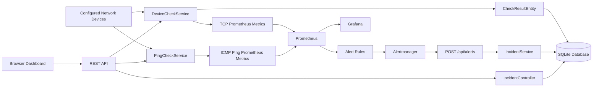
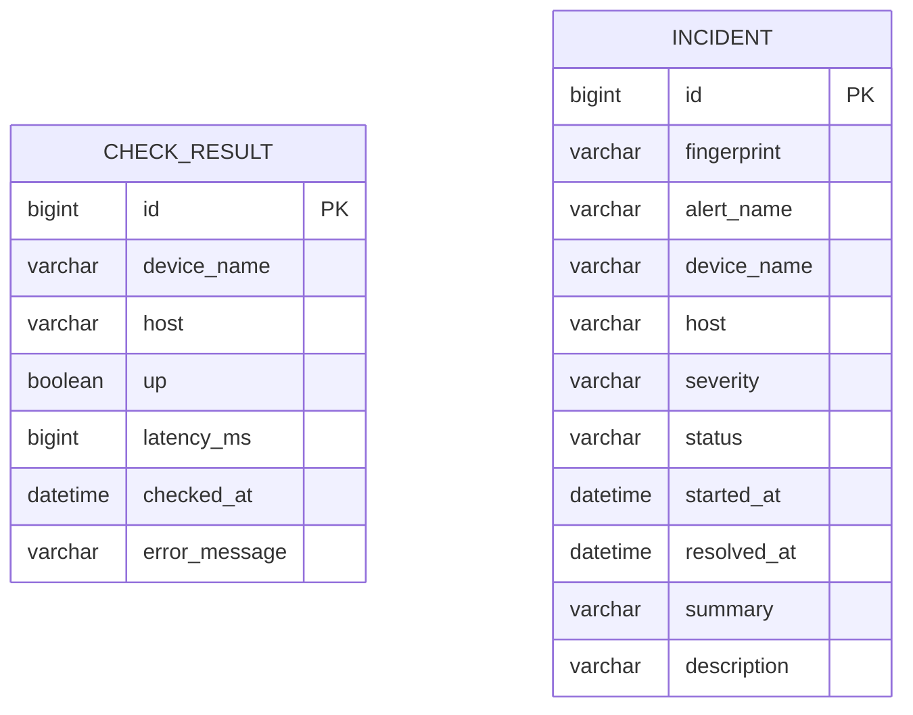
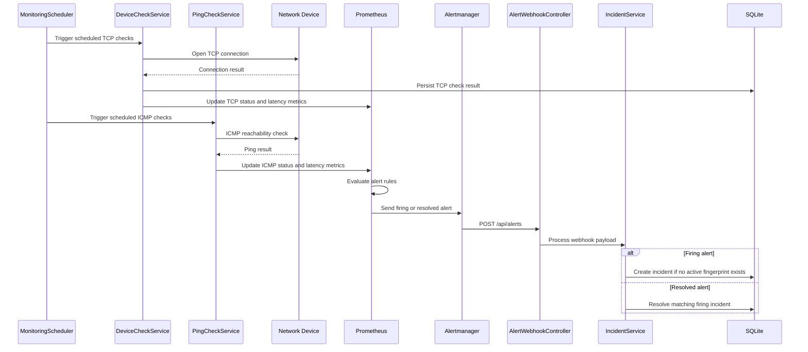
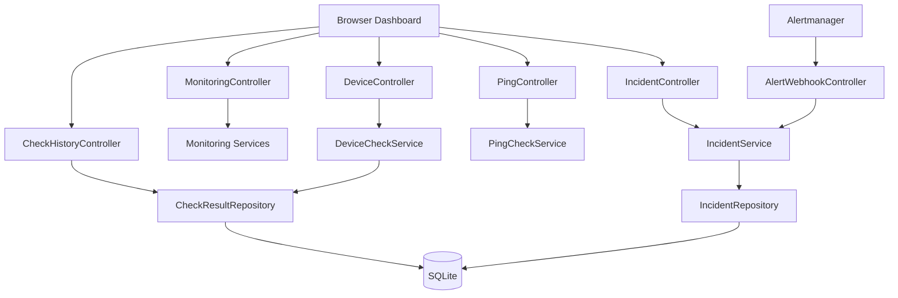
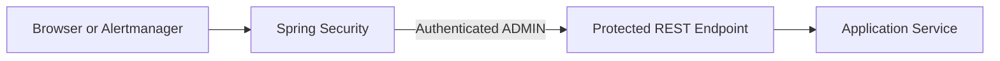
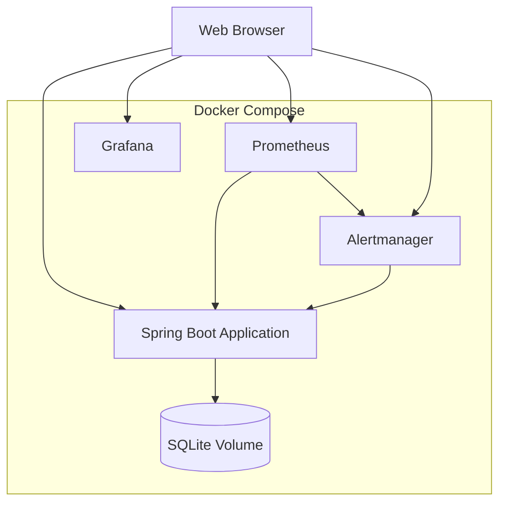

# System Architecture

## Overview

The Network Monitoring Dashboard is a Spring Boot application that performs TCP connectivity checks and ICMP ping checks, exposes Prometheus metrics, visualizes data in Grafana, manages incidents via Alertmanager webhooks, and provides a browser-based dashboard.

## System Architecture Diagram



## Components

| Component | Responsibility |
|---|---|
| Network devices | Configured targets checked through TCP and ICMP. |
| `DeviceCheckService` | Performs TCP connectivity checks, measures latency, stores results, and exposes TCP metrics. |
| `PingCheckService` | Performs ICMP reachability checks, measures ping latency, and exposes ICMP metrics. Ping results are not persisted. |
| `MonitoringScheduler` | Periodically triggers TCP and ICMP monitoring checks. |
| REST controllers | Provide device, check, history, incident, status, and webhook endpoints. |
| SQLite | Persists TCP check results and incidents. |
| `CheckResultEntity` | Represents persisted TCP check results. |
| `Incident` | Represents firing and resolved Alertmanager incidents. |
| Micrometer | Registers application, TCP, and ICMP metrics. |
| Prometheus | Scrapes metrics and evaluates alert rules. |
| Alertmanager | Groups and forwards firing or resolved alerts. |
| `IncidentService` | Creates, deduplicates, and resolves incidents based on alert fingerprints. |
| Grafana | Visualizes Prometheus metrics, including TCP and ICMP status and latency. |
| Web dashboard | Displays devices, TCP status, ICMP status, latency, latest checks, and incidents. |
| Spring Security | Protects administrative operations with HTTP Basic Authentication and the `ADMIN` role. |
| Docker Compose | Runs the application, Prometheus, Grafana, Alertmanager, and supporting services. |

## Database Model



> `CHECK_RESULT` stores persisted TCP connectivity checks. ICMP ping results are intentionally not persisted in SQLite; they are kept as the latest in-memory results and exposed through Prometheus metrics. `INCIDENT` records are created and resolved independently based on Alertmanager fingerprints. There is no direct foreign-key relationship between `CHECK_RESULT` and `INCIDENT`.

## Alert Flow



## Monitoring Data Flow

```text
Configured Network Devices
    -> DeviceCheckService
    -> TCP Check Results
    -> SQLite Check History

Configured Network Devices
    -> PingCheckService
    -> ICMP Ping Results
    -> In-memory Latest Results

TCP and ICMP Services
    -> Micrometer Metrics
    -> Prometheus
    -> Grafana

Prometheus Alert Rules
    -> Alertmanager
    -> AlertWebhookController
    -> IncidentService
    -> SQLite Incident History

Browser Dashboard
    -> REST API
    -> Devices, TCP Checks, ICMP Checks, and Incidents
```

## REST API Layer



## Security Architecture



> Public read-only endpoints provide monitoring data to the dashboard. Administrative operations, including manual checks and Alertmanager webhook processing, are protected by Spring Security using HTTP Basic Authentication and the `ADMIN` role. Credentials are injected through environment variables and are not stored in the repository.

## Deployment Architecture



| Service | URL |
|---|---|
| Spring Boot application | http://localhost:8080 |
| Grafana | http://localhost:3000 |
| Prometheus | http://localhost:9090 |
| Alertmanager | http://localhost:9093 |


## Application Metrics

The Spring Boot application exposes application-level metrics through
Spring Boot Actuator, Micrometer, and the Prometheus registry.

The metrics endpoint is available at:

```text
http://localhost:8080/actuator/prometheus
```

The following application metrics were verified from the running system.

### HTTP Metrics

HTTP server metrics are exposed using the following Prometheus metric family:

```text
http_server_requests_seconds_count
http_server_requests_seconds_sum
http_server_requests_seconds_max
```

These metrics contain labels such as:

- `method` – HTTP request method.
- `status` – HTTP response status code.
- `outcome` – general request outcome.
- `uri` – requested endpoint.
- `application` – application name.

The following endpoints were observed in the collected metrics:

```text
/api/checks/latest
/api/devices
/api/incidents
/api/incidents/active
/api/pings/latest
/api/alerts
/actuator/prometheus
```

The meaning of the main metrics is:

- `http_server_requests_seconds_count` – total number of requests.
- `http_server_requests_seconds_sum` – accumulated request processing time in seconds.
- `http_server_requests_seconds_max` – maximum observed request processing time in seconds.

Example PromQL queries:

```promql
rate(http_server_requests_seconds_count[5m])
```

```promql
sum by (uri, status) (
  rate(http_server_requests_seconds_count[5m])
)
```

```promql
sum by (uri) (
  rate(http_server_requests_seconds_sum[5m])
)
/
sum by (uri) (
  rate(http_server_requests_seconds_count[5m])
)
```

The last query calculates the average request duration per URI.

### JVM Memory Metrics

The application exposes JVM memory metrics including:

```text
jvm_memory_used_bytes
jvm_memory_committed_bytes
jvm_memory_max_bytes
jvm_memory_usage_after_gc
```

These metrics can be grouped by the `area` and `id` labels to distinguish
heap and non-heap memory pools.

Example PromQL query for used heap memory:

```promql
sum(jvm_memory_used_bytes{area="heap"})
```

Example PromQL query for heap memory utilization:

```promql
sum(jvm_memory_used_bytes{area="heap"})
/
sum(jvm_memory_max_bytes{area="heap",id="G1 Old Gen"})
```

The JVM memory values are exposed in bytes.

### JVM Thread Metrics

The following JVM thread metrics are available:

```text
jvm_threads_live_threads
jvm_threads_daemon_threads
jvm_threads_peak_threads
jvm_threads_started_threads_total
jvm_threads_states_threads
```

Example PromQL queries:

```promql
jvm_threads_live_threads
```

```promql
jvm_threads_peak_threads
```

```promql
sum by (state) (jvm_threads_states_threads)
```

These metrics can be used to identify increasing thread counts or unusual
thread states.

### CPU and Process Metrics

The application also exposes process and system CPU metrics:

```text
process_cpu_usage
process_cpu_time_ns_total
system_cpu_usage
system_cpu_count
```

The `process_cpu_usage` and `system_cpu_usage` values are represented as
ratios between 0 and 1.

Example PromQL queries:

```promql
process_cpu_usage * 100
```

```promql
system_cpu_usage * 100
```

```promql
system_cpu_count
```

During verification, the application exposed eight available processors,
and both process-level and system-level CPU usage metrics were available.

### Viewing Application Metrics in Grafana

The Prometheus datasource can be used in Grafana to visualize these metrics.

1. Open Grafana at `http://localhost:3000`.
2. Select the configured Prometheus datasource.
3. Create or open a dashboard panel.
4. Enter a PromQL query such as:
   `jvm_memory_used_bytes{area="heap"}`.
5. Select a time range such as `Last 15 minutes`.
6. Choose a visualization such as Time series, Gauge, or Stat.

The application metrics complement the network monitoring metrics. Network
metrics represent device reachability, TCP status, ping status, and latency.
Application metrics represent HTTP performance, JVM memory, JVM threads, and
CPU utilization.