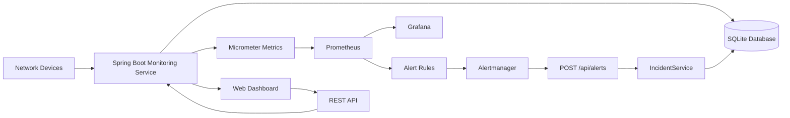
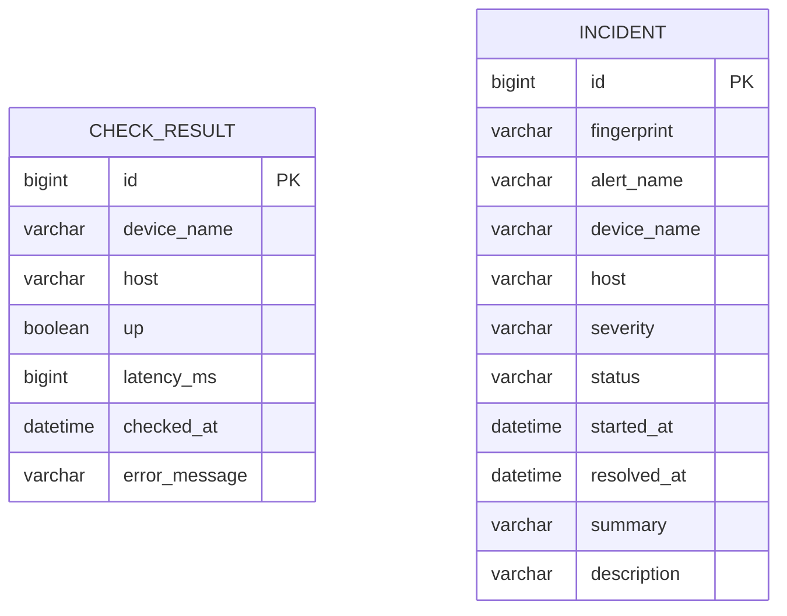
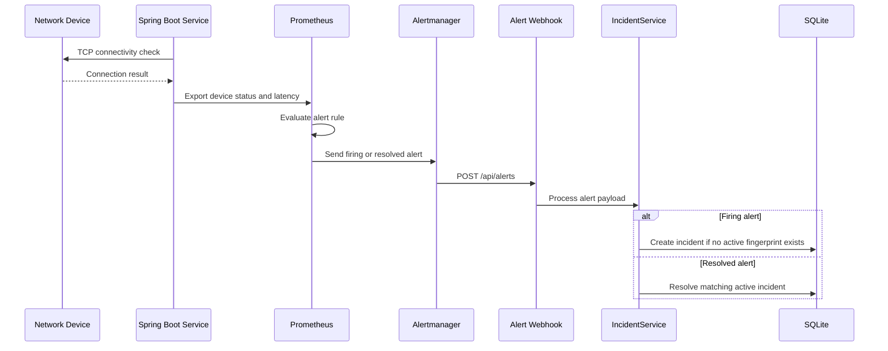

# System Architecture

## Overview

The Network Monitoring Dashboard consists of a Spring Boot monitoring service, a SQLite database, Prometheus, Grafana, Alertmanager, and a browser-based dashboard.

## System Architecture Diagram



## Components

| Component | Responsibility |
|---|---|
| Network devices | Devices checked by the monitoring service. |
| Spring Boot service | Executes checks and provides the REST API. |
| SQLite | Stores check results and incidents. |
| Micrometer | Exposes application and monitoring metrics. |
| Prometheus | Stores time-series metrics and evaluates alert rules. |
| Alertmanager | Groups and forwards alerts. |
| Grafana | Visualizes Prometheus metrics. |
| Web dashboard | Displays current device status and incidents. |

## Database Model



The current implementation stores check results and incidents as separate entities. They are related conceptually through the monitored device and timestamps, but the database model does not use a direct foreign-key relationship between them.

## Alert Flow



## Monitoring Data Flow

```text
Network Device
    -> Spring Boot Monitoring Service
    -> Prometheus Metrics
    -> Prometheus Alert Rules
    -> Alertmanager
    -> Incident Webhook
    -> SQLite Incident History
    -> Web Dashboard
```
