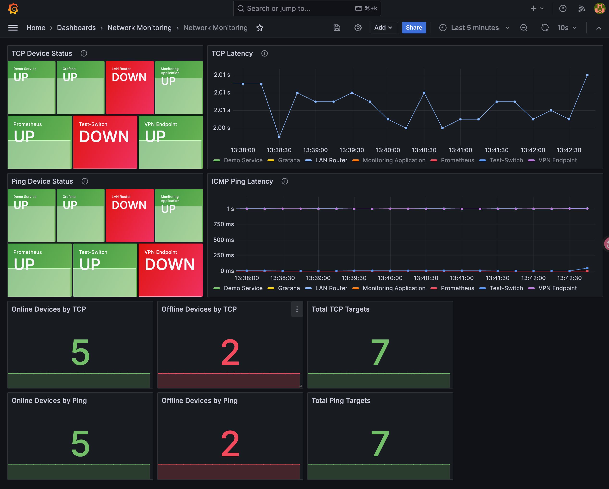
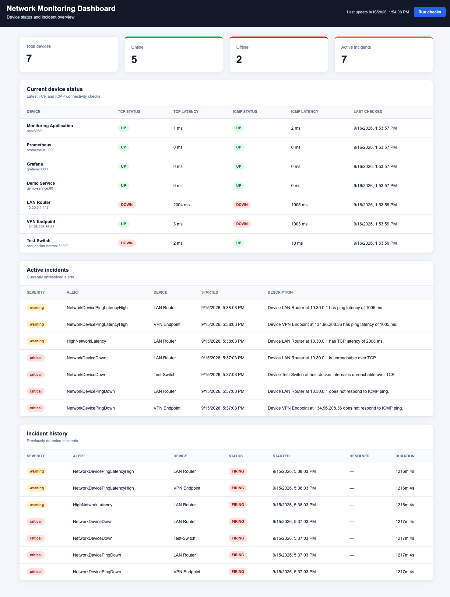
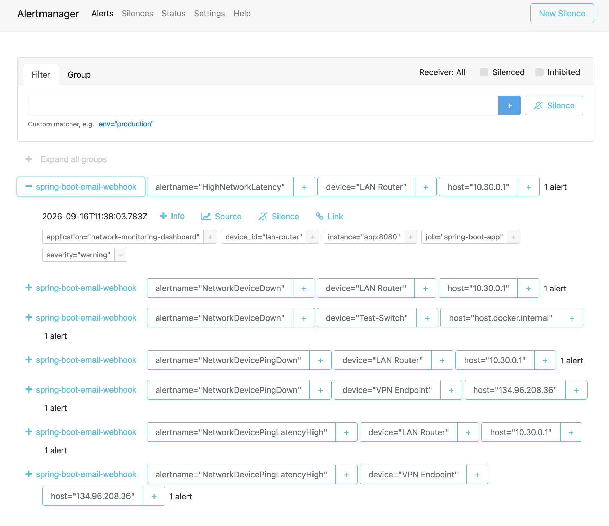
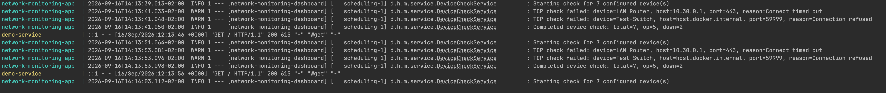
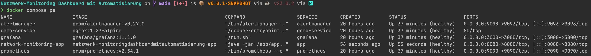

# Deployment and Screenshots

## Docker Compose Deployment

The project can be started with Docker Compose.

From the project root, run:

```bash
docker compose up --build
```

This command builds the application image and starts the services defined in the Docker Compose configuration.

To run in the background:

```bash
docker compose up --build -d
```

In a second terminal, check the container status:

```bash
docker compose ps
```

Stop the services with:

```bash
docker compose down
```

To remove containers and volumes as well, use:

```bash
docker compose down -v
```

## Service URLs

| Service | URL |
|---|---|
| Spring Boot application | http://localhost:8080 |
| Grafana | http://localhost:3000 |
| Prometheus | http://localhost:9090 |
| Alertmanager | http://localhost:9093 |

## Docker Verification

After startup, verify the application:

```bash
curl http://localhost:8080/api/status
```

Verify the health endpoint:

```bash
curl http://localhost:8080/actuator/health
```

Verify the ping endpoint:

```bash
curl http://localhost:8080/api/pings/latest
```

Check Prometheus metrics:

```bash
curl http://localhost:8080/actuator/prometheus
```

Expected result: the endpoints respond successfully and the containers are running.

## Docker Test Result

| Check | Expected result | Actual result |
|---|---|---|
| Docker image build | Successful | To be completed |
| Application container | Running | To be completed |
| Prometheus container | Running | To be completed |
| Grafana container | Running | To be completed |
| Alertmanager container | Running | To be completed |
| `/api/status` | HTTP 200 | To be completed |
| `/api/pings/latest` | HTTP 200 and JSON array | To be completed |
| `/actuator/health` | HTTP 200 | To be completed |
| `/actuator/prometheus` | Prometheus metrics available | To be completed |

## Screenshots

Store screenshots in:

```text
docs/img/
```

### Grafana Dashboard

Open:

```text
http://localhost:3000
```

Then:

1. Log in to Grafana.
2. Open the `Network Monitoring` dashboard.
3. Select a time range such as `Last 15 minutes`.
4. Make sure the dashboard shows:
   - TCP device status and latency.
   - ICMP ping status and latency.
   - Online devices, offline devices, and total devices.
5. Take a screenshot containing the dashboard title, time range, and several panels.

Recommended file:

```text
docs/img/grafana-dashboard.png
```

Markdown inclusion:



### Spring Boot Web Dashboard

Open:

```text
http://localhost:8080
```

The screenshot should show:

- Total devices.
- Online devices.
- Offline devices.
- Active incidents.
- Current TCP and ICMP device status.
- Incident history.

Recommended file:

```text
docs/img/application-dashboard.png
```

Markdown inclusion:



### Alertmanager Alert

Open:

```text
http://localhost:9093
```

For a safe test:

1. Use a non-critical test device or controlled test target.
2. Make the target unreachable, if this is safe in your environment.
3. Wait until the Prometheus rule condition and configured `for` period have elapsed.
4. Open Alertmanager.
5. Capture the alert name, severity, labels, and firing state.
6. Restore the test target and capture the resolved state if required.

Do not intentionally interrupt production or critical network devices.

Recommended files:

```text
docs/img/alertmanager-firing.png
```

Markdown inclusion:



### Docker Compose Startup

Run:

```bash
docker compose up --build
```

Take a screenshot showing the image build and service startup without errors.

Then run:

```bash
docker compose ps
```

Take another screenshot showing the services in the `Up` or `running` state.

Recommended files:

```text
docs/img/docker-compose-up.png
docs/img/docker-compose-ps.png
```

Markdown inclusion:






## Security and Privacy

Before publishing screenshots:

- Remove passwords and tokens.
- Hide private IP addresses if necessary.
- Avoid showing personal usernames or hostnames.
- Use only test devices for alert demonstrations.